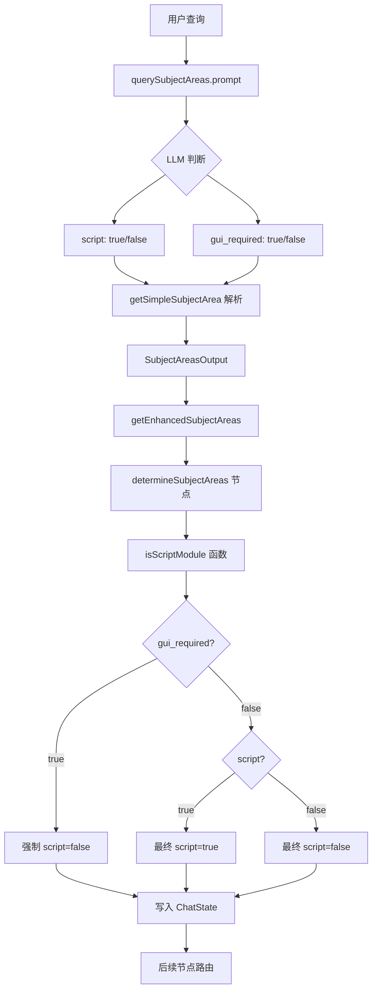

# SubjectAreas Script 标记完整分析报告

> **生成时间**: 2026-03-06  
> **分析范围**: SubjectAreas 模块中所有与 script 标记相关的 prompt 规则和代码逻辑

---

## 目录

1. [Script 标记判定规则](#1-script-标记判定规则)
2. [Script 标记影响的逻辑分支](#2-script-标记影响的逻辑分支)
3. [Prompt 中的 Script 判断规则](#3-prompt-中的-script-判断规则)
4. [代码中的 Script 判断逻辑](#4-代码中的-script-判断逻辑)
5. [Script 标记的数据流](#5-script-标记的数据流)
6. [测试风险点](#6-测试风险点)
7. [测试用例参考](#7-测试用例参考)

---

## 1. Script 标记判定规则

### 1.1 什么情况下 script = true？

Script 标记为 `true` **仅当满足以下任一条件**：

| 序号 | 触发条件 | 说明 | 示例 |
|------|---------|------|------|
| 1 | **显式脚本/代码创建** | 用户明确提到编写、创建或编辑脚本、代码或自定义表达式 | "如何编写脚本修改图表颜色？" |
| 2 | **编程语言提及** | 查询中引用具体编程语言（JavaScript、Python 等） | "用 JavaScript 控制组件可见性" |
| 3 | **复杂逻辑控制** | 涉及实现复杂逻辑控制结构（多层嵌套条件、循环等） | "写一个循环遍历所有行的表达式" |
| 4 | **自定义函数定义** | 需要定义新函数或算法，非内置功能 | "定义一个自定义日期格式化函数" |
| 5 | **Admin Console 操作** | 用户提到 "admin console" 或必须通过管理控制台完成的操作 | "用 Admin Console 脚本创建数据源" |
| 6 | **runquery 使用** | 任何涉及使用或操作 `runquery` 结果的查询 | "用 runQuery 加载数据并更新文本组件" |
| 7 | **Function 提及** | 查询提到 "function" 并指向函数使用/调用/基于函数的操作 | "调用 chartAPI 函数创建图表" |

### 1.2 什么情况下 script = false？

**除上述所有条件以外的所有情况**，统一视为 `script = false`，包括但不限于：

- 使用 Formula Editor 中的 CALC 函数（GUI 辅助功能）
- 通过 UI 界面进行配置操作
- 概念性问题或功能说明
- 使用内置的条件格式化功能
- "function" 指代产品功能而非代码函数

### 1.3 最终判定逻辑（代码层面）

最终的 script 标记由 `isScriptModule` 函数决定：

```typescript
function isScriptModule(gui_required?: boolean, script?: boolean): boolean {
    return !gui_required && script;
}
```

**关键点**：
- 即使 `script = true`，如果 `gui_required = true`，最终仍会被判定为 **非脚本场景**
- 只有当 `gui_required` 为 `false` 或 `undefined`，且 `script = true` 时，才最终为脚本场景

---

## 2. Script 标记影响的逻辑分支

### 2.1 在 SubjectArea 检索阶段（getSubjectArea.ts）

**影响范围**：透明传递，不改变 SubjectArea 筛选逻辑

```typescript
// getSimpleSubjectArea 解析 script 字段
const script = parsed?.script ?? false;

// getEnhancedSubjectAreas 保留并传递
return {
    subjectAreas: resultAreas,
    script: script,  // 原样传递
    // ...
};
```

**特点**：
- `script` 值在此阶段仅作为标记随结果返回
- 不会影响 SubjectArea 的筛选、排序或优先级
- 保持数据完整性，供下游节点使用

### 2.2 在 Chat Agent 的 subjectAreas 节点（subjectAreas.ts）

**影响范围**：决定对话路由和回答模式

```typescript
// 调用 isScriptModule 进行最终归一化
const script = isScriptModule(result.gui_required, result.script);

// 写入 ChatState
return {
    script,  // 影响后续节点的路由决策
    // ...
};
```

**逻辑效果**：

| gui_required | result.script | 最终 script | 场景描述 |
|--------------|---------------|-------------|----------|
| false/undefined | true | **true** | 脚本/表达式问题场景 |
| false/undefined | false | **false** | 非脚本场景 |
| true | true | **false** | 需要 GUI，强制视为非脚本 |
| true | false | **false** | 非脚本场景 |

**下游影响**：
- 路由到脚本相关的 agent/工具链（如表达式编写助手）
- 在后续对话中作为条件，区分"脚本回答模式" vs "操作/功能使用回答模式"
- 影响知识库检索策略（脚本文档 vs 操作文档）

---

## 3. Prompt 中的 Script 判断规则

### 3.1 querySubjectAreas.prompt 中的规则

**位置**：`### 6. Dynamic & Script & GUI Determination Logic`

**完整规则文本**：

```yaml
Script Determination Rules:
- script = true ONLY when the query meets ANY of the following criteria:
  1. Explicit Script/Code Creation: User explicitly mentions writing, creating, or editing scripts, code, or custom expressions
  2. Programming Language Mention: Query references specific programming languages (JavaScript, Python, etc.)
  3. Complex Logic Required: Involves implementing complex logical control structures (multiple nested conditions, loops, etc.)
  4. Custom Function Definition: Requires defining new functions or algorithms not available as built-in features
  5. Admin Console Operations: User mentions "admin console" or operations that must be performed through the admin console interface
  6. runquery Usage: Any query involving the use or manipulation of runquery results
  7. Function Mention: Query mentions "function" (e.g., using functions, calling functions, function-based operations)

- script = false in ALL other cases.
```

**输出格式**：

```yaml
script: <true|false>
gui_required: <true|false>
dynamic: <true|false>
```

### 3.2 completeQueryByHistory.prompt 中的规则

**位置**：`## Script Identification Rule`

**用途**：仅用于历史补全，不影响最终 `result.script`

**规则文本**：

```
For each extracted SubjectArea, determine script independently.
- Set script = true if the user question in that SubjectArea is primarily about 
  writing or using expressions/formulas/scripts, including:
  - referencing fields or rows (e.g., field[...], relative row, offset)
  - calculated fields or expression columns
  - syntax, functions, or calculation logic

- Set script = false if the user question is primarily about where or how to 
  operate in the product, including:
  - UI steps, menus, settings, or permissions
  - feature usage flows (how to create, configure, enable something)
  - conceptual or descriptive questions without expression logic
```

**关键差异**：
- 此处的 `script` 标记是 **per-SubjectArea** 的，用于区分历史对话中每轮的意图
- 仅影响 `replaced_query` 的补全风格（表达式导向 vs 操作导向）
- **不会回传**到 TypeScript 代码中的 `SubjectAreasOutput.script` 字段

**在 Completion Algorithm 中的作用**：

```
2. Special Handling for Confirmations/Selections:
   - Determine whether the latest matched SubjectArea has script = true.
   - If script = true:
     - The reconstructed replaced_query MUST remain expression/script-oriented.
     - Do NOT rewrite it into UI steps, feature usage, or conceptual questions.
   - If script = false:
     - Reconstruct the replaced_query as a product operation, feature usage, 
       or configuration intent.
```

---

## 4. 代码中的 Script 判断逻辑

### 4.1 核心文件和函数

#### 文件 1: `getSubjectArea.ts`

**接口定义**：

```typescript
export interface SubjectAreasOutput {
    subjectAreas: SubjectArea[],
    completedQuery?: string;
    dynamic?: boolean;
    script?: boolean;
    gui_required?: boolean;
    preferRewriteWithContext?: boolean;
}
```

**关键函数**：

##### `getSimpleSubjectArea()`

```typescript
export async function getSimpleSubjectArea(...): Promise<SubjectAreasOutput> {
    // 调用 querySubjectAreas.prompt
    const template = await getPromptTemplate({ promptName: "querySubjectAreas", ... });
    
    return invokeLLMWithRetry({...}).then(result => {
        const parsed = parseYaml<any>(result.response);
        
        // 解析 script 字段，默认为 false
        const script = parsed?.script ?? false;
        const gui_required = parsed?.gui_required ?? false;
        
        return {
            subjectAreas: areasArray,
            script: script,
            gui_required: gui_required,
            // ...
        };
    });
}
```

##### `getEnhancedSubjectAreas()`

```typescript
export async function getEnhancedSubjectAreas(...): Promise<SubjectAreasOutput> {
    // 根据历史和上下文增强 SubjectArea
    const output = await getSimpleSubjectArea(completedQuery, history, ...);
    
    // 保留并传递 script 标记
    return {
        subjectAreas: resultAreas,
        dynamic: dynamic,
        script: script,  // 原样传递
        gui_required: gui_required,
        completedQuery: completedQuery,
    };
}
```

##### `isScriptModule()`

```typescript
export function isScriptModule(gui_required?: boolean, script?: boolean): boolean {
    return !gui_required && script;
}
```

**逻辑说明**：
- 这是最终脚本标记的统一出口
- 实现了 `gui_required` 对 `script` 的覆盖逻辑
- 返回值决定是否进入脚本处理流程

#### 文件 2: `subjectAreas.ts`

**主流程函数**：

```typescript
export const determineSubjectAreas = withStepTime(async function determineSubjectAreas(state: ChatState): Promise<Partial<ChatState>> {
    // 调用 getSubjectArea 获取结果
    const result = await getSubjectArea(question, chatHistory, ...);
    
    // 调用 isScriptModule 做最终归一化
    const script = isScriptModule(result.gui_required, result.script);
    
    // 写入 ChatState，供后续节点使用
    return {
        subjectAreas,
        script,  // 影响后续路由
        // ...
    };
});
```

### 4.2 数据流转路径

```
用户查询
    ↓
querySubjectAreas.prompt (LLM 判断)
    ↓
YAML 输出: script: true/false, gui_required: true/false
    ↓
getSimpleSubjectArea() 解析
    ↓
SubjectAreasOutput { script, gui_required }
    ↓
getEnhancedSubjectAreas() 传递
    ↓
determineSubjectAreas() 节点
    ↓
isScriptModule(gui_required, script)
    ↓
最终 script 标记写入 ChatState
    ↓
后续节点根据 script 标记路由
```

---

## 5. Script 标记的数据流

### 5.1 主流程数据流



### 5.2 历史补全流程（并行）

```
用户查询 + 历史对话
    ↓
completeQueryByHistory.prompt
    ↓
提取历史 SubjectArea (每个带 script 标记)
    ↓
根据历史 script 决定补全风格
    ↓
生成 replaced_query
    ↓
(不影响最终 result.script)
```

---

## 6. 测试风险点

### 6.1 LLM 语义理解不稳定

**风险**：相同意图在不同措辞下可能得到不同的 script 判定

**测试建议**：
- 设计语义相近但措辞变化的用例
- 在不同模型配置下重复测试
- 验证中英文混合场景

### 6.2 "function" 关键词歧义

**风险**："功能" vs "函数" 的语义混淆

**测试用例**：
- ✅ "写一个自定义函数 function()..." → script=true
- ❌ "这个导出功能（export function）怎么用？" → script=false

### 6.3 编程语言提及的边界

**风险**：提到语言名称但非编码意图

**测试用例**：
- ✅ "用 JavaScript 脚本控制可见性" → script=true
- ❌ "系统是不是用 JavaScript 写的？" → script=false

### 6.4 复杂逻辑判断标准模糊

**风险**：可通过 GUI 实现的复杂场景被误判为脚本

**测试建议**：
- 设计"看似复杂但有内置功能"的场景
- 设计"必须用脚本"的场景
- 对比两者的判定结果

### 6.5 runquery 识别覆盖不全

**风险**：不同拼写方式可能漏判

**测试用例**：
- `runQuery`、`run query`、`run-query`
- 中文："运行查询结果"、"执行查询返回的数据"

### 6.6 gui_required 覆盖 script 的风险

**风险**：用户同时表达脚本需求和 UI 偏好时的冲突

**测试矩阵**：

| gui_required | script | 最终结果 | 是否符合预期 |
|--------------|--------|----------|--------------|
| false | false | false | ✅ |
| false | true | true | ✅ |
| true | false | false | ✅ |
| true | true | **false** | ⚠️ 需验证 |

### 6.7 历史 script 与当前 script 不一致

**风险**：多轮对话中历史意图与当前判定冲突

**场景**：
- 前几轮：脚本问题（history.script=true）
- 当前轮："是的，就那样"（可能被判为 script=false）
- 结果：replaced_query 是脚本导向，但 result.script=false

### 6.8 YAML 解析默认值风险

**风险**：LLM 输出格式异常时静默归为 false

**代码位置**：
```typescript
const script = parsed?.script ?? false;  // 缺失时默认 false
```

### 6.9 多 SubjectArea 与全局 script 标记

**风险**：一个问题包含多个意图时，全局 script 可能过度脚本化

**测试场景**：
- 同时包含"写表达式"和"设置界面选项"
- 观察是否所有模块都被视为脚本场景

### 6.10 contextType 的间接影响

**风险**：不同上下文类型对脚本期望不同

**测试建议**：
- 针对不同 contextType（chart/table/worksheet 等）设计脚本问题
- 验证 script 标记与具体模块是否匹配用户期望

---

## 7. 测试用例参考

### 7.1 正向用例（script=true）

| 用例 | 查询 | 触发规则 |
|------|------|----------|
| 1 | "如何编写脚本修改图表点的颜色？" | 规则 1: 显式脚本创建 |
| 2 | "用 chart API 脚本创建散点图" | 规则 1 + 2 |
| 3 | "用 JavaScript 控制文本组件可见性" | 规则 2: 编程语言 |
| 4 | "写一个循环遍历所有行的表达式" | 规则 3: 复杂逻辑 |
| 5 | "定义一个自定义日期格式化函数" | 规则 4: 自定义函数 |
| 6 | "用 Admin Console 脚本创建数据源" | 规则 5: Admin Console |
| 7 | "用 runQuery 加载数据并更新文本" | 规则 6: runquery |
| 8 | "调用 chartAPI 函数创建子弹图" | 规则 7: function |

### 7.2 负向用例（script=false）

| 用例 | 查询 | 原因 |
|------|------|------|
| 1 | "用 CALC.sum 计算总销售额" | CALC 函数是 GUI 辅助 |
| 2 | "如何在界面上设置条件格式？" | UI 操作 |
| 3 | "什么是 Admin Console？" | 概念问题 |
| 4 | "系统是用 JavaScript 写的吗？" | 非编码意图 |
| 5 | "导出功能怎么用？" | "功能"非"函数" |
| 6 | "如何用 UI 配置动态过滤器？" | 明确 UI 偏好 |

### 7.3 边界用例

| 用例 | 查询 | 预期 | 关键点 |
|------|------|------|--------|
| 1 | "用 CALC.sum 和自定义函数计算" | true | 包含自定义函数 |
| 2 | "不写代码，用表达式实现" | false | 明确不写代码 |
| 3 | "运行查询结果并显示" | true | 语义上的 runquery |
| 4 | "Yes, use that script" (多轮) | true | 历史为脚本场景 |

---

## 附录：相关文件清单

### Prompt 文件
1. `chat-app/server/prompts-v2/subjectAreas/querySubjectAreas.prompt`
2. `chat-app/server/prompts-v2/subjectAreas/completeQueryByHistory.prompt`
3. `chat-app/server/prompts-v2/subjectAreas/scriptKnowledgeBase.md`

### 代码文件
1. `chat-app/server/src/tools/retrieval/getSubjectArea.ts`
2. `chat-app/server/src/agents/chatAgent/nodes/subjectAreas.ts`

### 文档文件
1. `scriptDoc/subjectAreas-script-analysis.md`
2. `scriptDoc/subjectAreas-script-testcases.md`
3. `scriptDoc/subjectAreas-script-risk-analysis.md`

---

**报告结束**
