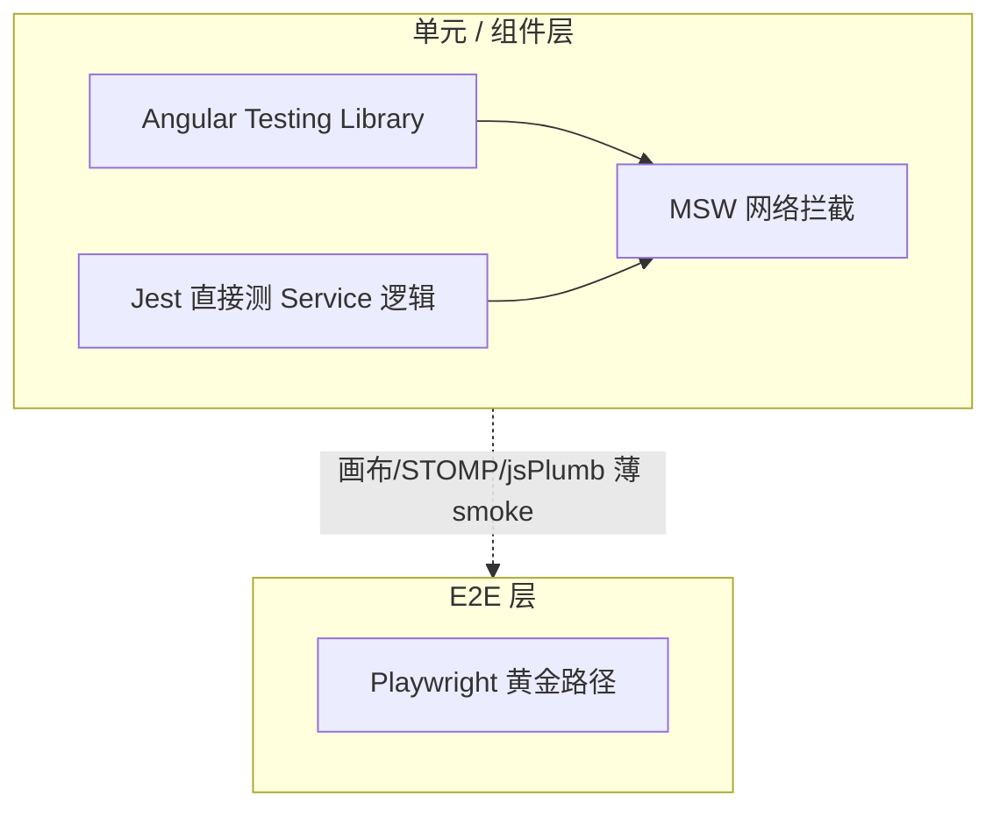

# Portal 单元测试分析与实施指南

> **范围**：`community/web/projects/portal`  
> **目标栈**：Angular Testing Library (ATL) + MSW  
> **关联文档**：`Testing_architecture_UI.zh-CN.md`、`claude/frontend-testing-strategy.md`

---

## 执行摘要

| 指标 | 数值 |
|------|------|
| Component 总数 | 753 |
| 有 spec 的 Component | 181（**~24%**） |
| Service 总数 | 127 |
| 有 spec 的 Service | 8（**~6%**） |
| 传统 `*.spec.ts` | ~242 |
| ATL `*.tl.spec.ts` | 1（`axis-label-pane.tl.spec.ts`） |
| CI 覆盖率门禁 | **无**（未配置 `collectCoverage`） |

**结论**：存量测试以 `TestBed` + `NO_ERRORS_SCHEMA` 为主；ATL + MSW 基础设施已就绪，Portal 侧几乎未落地。不建议为全部 753 个 component 一次性补测，应按 **风险 × 体量 × 可测性** 分阶段推进。

---

## 1. 模块结构与代码规模

```
projects/portal/src/app/
├── portal/       # 门户路由：Dashboard、Data、Schedule、Report
├── composer/     # Viewsheet / Worksheet 设计器
├── vsobjects/    # Viewsheet 运行时视觉对象
├── vsview/       # Viewsheet 查看器视图层
├── binding/      # 数据绑定编辑器
├── graph/        # 图表配置 UI
├── widget/       # 可复用 UI 组件库
├── format/       # 格式/样式编辑器
├── vs-wizard/    # 可视化向导
├── viewer/       # Viewer 应用
├── common/       # 共享服务（viewsheet-client、repository-client 等）
├── embed/        # 嵌入相关
└── status-bar/   # 状态栏
```

### 1.1 各模块统计

| 模块 | Components | Services | 传统 spec | ATL spec | TS 行数(约) | Component 覆盖率 |
|------|------------|----------|-----------|----------|-------------|------------------|
| portal | 142 | 24 | 9 | 0 | 44,402 | **6.3%** |
| composer | 176 | 16 | 54 | 0 | 55,408 | 26.1% |
| vsobjects | 121 | 23 | 76 | 0 | 55,882 | 35.5% |
| widget | 162 | 27 | 54 | 0 | 36,244 | 24.7% |
| binding | 92 | 10 | 27 | 0 | 21,186 | 27.2% |
| graph | 20 | 1 | 9 | 1 | 6,995 | 35.0% |
| vs-wizard | 21 | 1 | 6 | 0 | 7,112 | 28.6% |
| format | 5 | 0 | 3 | 0 | 859 | 60.0% |
| viewer | 4 | 3 | 1 | 0 | 1,362 | 25.0% |
| vsview | 4 | 0 | 1 | 0 | 2,493 | 25.0% |
| common | 2 | 20 | 5 | 0 | 14,228 | 0% |
| embed | 2 | 1 | 0 | 0 | 1,651 | 0% |
| status-bar | 1 | 0 | 0 | 0 | 113 | 0% |
| **合计** | **753** | **127** | **~242** | **1** | **~247k** | **~24%** |

### 1.2 其他可测资产

| 类型 | 数量 | 已有 spec |
|------|------|-----------|
| `*-actions.ts` | 42 | 27 (`*-actions.spec.ts`) |
| directive / pipe / util | 若干 | 部分有 spec |

---

## 2. 现有测试：工具、模式与质量

### 2.1 工具栈

```text
┌─────────────────────────────────────────────────────────────┐
│ 默认 CI: ng test portal (@angular-builders/jest)            │
│   → 执行 *.spec.ts，忽略 *.tl.spec.ts                       │
├─────────────────────────────────────────────────────────────┤
│ 新栈: npm run test:tl (jest.tl.config.js)                   │
│   → 仅执行 *.tl.spec.ts                                     │
├─────────────────────────────────────────────────────────────┤
│ 运行时: Jest 29 + jest-preset-angular + jest-fixed-jsdom    │
│ 新编写: @testing-library/angular + user-event + jest-dom  │
│ 网络:   MSW v2（setup-jest.ts 全局 server.listen）          │
│ 存量:   TestBed + fixture + NO_ERRORS_SCHEMA                │
│         querySelector / HttpClientTestingModule             │
└─────────────────────────────────────────────────────────────┘
```

**关键配置文件**

| 文件 | 作用 |
|------|------|
| `community/web/angular.json` | portal test 忽略 `\.tl\.spec\.ts$` |
| `community/web/jest.config.js` | MSW / jest-fixed-jsdom 映射 |
| `community/web/jest.tl.config.js` | ATL 专用，`testMatch: **/*.tl.spec.ts` |
| `community/web/setup-jest.ts` | jest-preset-angular + jest-dom + MSW server |
| `community/web/mocks/server.ts` | 聚合 model / composer / em handlers |

### 2.2 存量 spec 分类（约 242 个）

| 类别 | 约数量 | 说明 |
|------|--------|------|
| component 相关 | ~72 | `*.component.spec.ts` |
| action 逻辑 | 27 | `*-actions.spec.ts` |
| dialog / pane / editor | ~83 | 属性对话框、绑定面板等 |
| 其他 | ~60 | directive、pipe、util 等 |

### 2.3 存量测试的典型问题

（见 `claude/frontend-testing-strategy.md`）

- 大量 **`NO_ERRORS_SCHEMA`**：浅渲染，子组件未真实参与。
- **`fixture.nativeElement.querySelector('.class')`**：依赖 CSS class，重构易碎。
- **`HttpClientTestingModule`**：只拦截 Angular HttpClient，无法模拟网络层错误/超时。
- **无覆盖率收集**：无法量化回归缺口。

### 2.4 新栈参考实现

**Portal（唯一 ATL spec）**

- `projects/portal/src/app/graph/dialog/axis-label-pane.tl.spec.ts`
- 模式：`render()` + `screen` + `userEvent` + `componentProperties`

**EM（已验证，可复制）**

- 14 个 `*.component.tl.spec.ts`（auditing 等）
- 1 个 `authorization.service.tl.spec.ts`（Service + MSW）
- 模式：`render()` + `server.use(http.get(...))` + `HttpClientModule`

### 2.5 覆盖率说明

- **文件级估算**：Component ~24%，Service ~6%。
- **行级覆盖率**：仓库未配置 `collectCoverage`，CI 无门禁。
- 如需量化，可执行：

```bash
cd community/web
npx ng test portal --coverage --no-ci
npx jest --config=jest.tl.config.js --coverage
```

---

## 3. 测试分层与框架选型

### 3.1 架构原则（与 UI 测试架构对齐）



| 测试类型 | 主要职责 | 应放这里 | 不应膨胀 |
|----------|----------|----------|----------|
| 单元 / 组件 | 逻辑、验证、UI 状态 | 字段校验、条件 UI、服务转换 | 完整多页工作流 |
| Service 单测 | 纯逻辑、HTTP 契约 | 模型转换、工厂、REST 参数 | DOM 渲染 |
| E2E | 集成、黄金路径 | 设计器打开、保存、查看 | 穷举字段排列 |

### 3.2 框架选型矩阵

| 被测对象 | 推荐框架 | 文件名 | 运行命令 |
|----------|----------|--------|----------|
| 表单 / 对话框 / 列表（HTTP 重） | **ATL + MSW** | `*.component.tl.spec.ts` | `npm run test:tl` |
| 纯展示 / 简单交互 | **ATL**（无 MSW） | `*.component.tl.spec.ts` | `npm run test:tl` |
| 纯逻辑 Service | **Jest 直接实例化** | `*.service.spec.ts` | `ng test portal` |
| HTTP Service | **MSW + TestBed/直接注入** | `*.service.tl.spec.ts` | `npm run test:tl` |
| STOMP / WebSocket 重 | **Mock StompClientService** | 同上或 component spec | `ng test portal` |
| 画布 / jsPlumb / interact | **1–3 条 smoke + E2E** | 可选薄 `*.tl.spec.ts` | E2E 为主 |
| Action 类（无模板） | **Jest 直接测** | `*-actions.spec.ts` | `ng test portal` |

### 3.3 查询优先级（ATL）

| 优先级 | API | 场景 |
|--------|-----|------|
| 1 | `getByRole('button', { name })` | 按钮、链接、输入 |
| 2 | `getByLabelText` | 表单字段 |
| 3 | `getByPlaceholderText` | 无 label 输入 |
| 4 | `getByText` | 静态文本 |
| 5 | `getByTestId` | 无语义时加 `data-testid` |

**避免**：`querySelector('.submit-button')` 等 CSS 选择器断言。

---

## 4. 优先级路线图

### 4.1 总体策略

**Risk-first + 大文件优先 + 可测性分层**

- 目标规模建议：**180–220 个高价值 component** + **30–40 个 service**（非 753 全量）。
- 新用例统一 **`*.tl.spec.ts`**，存量 `*.spec.ts` 渐进迁移。
- 画布级组件不强行 ATL 深测，交给 Playwright E2E。

### 4.2 P0 — 立即做（ATL + MSW）

HTTP 重、用户路径关键、覆盖极低（portal 模块 6.3%）。

| ID | 组件 / 区域 | 约行数 | 说明 |
|----|-------------|--------|------|
| P0-1 | `data-sources-tree-view.component` | 1601 | Data 浏览核心 |
| P0-2 | `data-datasource-browser.component` | 908 | 数据源入口 |
| P0-3 | `data-folder-browser.component` | 1130 | 文件夹浏览 |
| P0-4 | `database-physical-model.component` | 1347 | 物理模型 |
| P0-5 | `schedule-task-list.component` | 920 | 调度列表 |
| P0-6 | `portal/schedule/schedule-task-editor/*` | 混合 | 任务编辑子面板（部分已有 legacy spec，优先迁移） |
| P0-7 | `portal/dashboard`、相关 dialog | 混合 | Dashboard 管理 |

**前置工作**：新增 `community/web/mocks/handlers/portal.handlers.ts`（data / schedule / dashboard API），并注册到 `mocks/server.ts`。

### 4.3 P1 — 高价值（ATL + Mock STOMP / 部分 MSW）

| ID | 区域 | 代表大文件（约行数） | 框架 |
|----|------|----------------------|------|
| P1-1 | vsobjects 运行时 | `vs-object-container` (710)、`vs-calctable` (695)、`preview-table` (816) | ATL + Mock ViewsheetClient |
| P1-2 | vsobjects 选择/日历 | `month-calendar` (1026) | ATL + Mock |
| P1-3 | binding | `binding-editor`、已有 spec 的 editor 迁移 | ATL 迁移 |
| P1-4 | vs-wizard | `vs-wizard-pane` (975) | ATL + MSW |
| P1-5 | vsview | `vs-binding-pane` (942) | ATL + MSW |
| P1-6 | graph 对话框 | `axis-*`、`legend-*`（已有 legacy spec） | 迁为 `.tl.spec.ts`，以 `axis-label-pane.tl.spec.ts` 为模板 |

### 4.4 P2 — 分批推进

| 区域 | 现状 | 动作 |
|------|------|------|
| composer/dialog | 54 spec，质量参差 | 优先迁移 querySelector 多的 spec |
| widget | 40/162 有 spec | 通用控件 ATL；纯展示 minimal smoke |
| format | 3/5 有 spec | ATL 补齐 |

### 4.5 P3 — 薄 smoke 或 E2E

依赖 jsPlumb、interact、canvas、STOMP 实时流，**不建议 ATL 深测**。

| 组件 | 约行数 | 策略 |
|------|--------|------|
| `ws-pane.component` | 1076 | smoke + E2E |
| `layout-pane.component` | 981 | smoke + E2E |
| `chart-area.component` | 1362 | smoke + E2E |
| `ws-details-pane.component` | 812 | smoke + E2E |
| `asset-tree-pane.component` | 909 | smoke + E2E |
| `editable-object-container.component` | 有 legacy spec | 维护成本高，逐步 smoke 化 |

### 4.6 存量迁移试点（高收益）

优先将以下 **legacy spec → `.tl.spec.ts`**：

```
vsobjects/objects/submit/vs-submit.spec.ts
portal/dialog/edit-dashboard-dialog.spec.ts
binding/editor/chart/field/dimension-editor.spec.ts
binding/editor/table/calc-group-option.component.spec.ts
widget/condition/*（querySelector 较多）
composer/dialog/vs/*（属性面板）
```

---

## 5. Service 测试指南

### 5.1 已有 Service 测试（8 个）

| Service | 路径 | 测试方式 |
|---------|------|----------|
| ChartService | `graph/services/chart.service.spec.ts` | 直接实例化 + mock model ✅ 推荐模式 |
| ViewsheetClientService | `common/viewsheet-client/` | TestBed |
| RepositoryClientService | `common/repository-client/` | TestBed |
| AssetClientService | `common/asset-client/` | TestBed |
| ComposerObjectService | `composer/gui/vs/` | TestBed |
| FormInputService | `vsobjects/util/` | TestBed |
| GlobalSubmitService | `vsobjects/util/` | TestBed |
| DebounceService | `widget/services/` | 直接测 |

### 5.2 建议优先补充的 Service（未覆盖 Top 20 按行数）

| 优先级 | Service | 约行数 | 建议 | 框架 |
|--------|---------|--------|------|------|
| S0 | data-model-browser.service | 643 | **强烈建议** | `.service.tl.spec.ts` + MSW |
| S0 | datasource-browser.service | 401 | **强烈建议** | MSW |
| S0 | vs-chart.service | 365 | **强烈建议** | 逻辑直接测 + HTTP 用 MSW |
| S0 | data-browser.service | 217 | **建议** | MSW |
| S0 | data-query-model.service | 296 | **建议** | MSW |
| S1 | binding-tree.service | 411 | **建议** | 逻辑单测 |
| S1 | vs-chart-editor.service | 234 | **建议** | 与 binding 联动 |
| S1 | assembly-action-factory.service | 240 | **建议** | 工厂分支 |
| S1 | repository-tree.service | 243 | **建议** | MSW |
| S1 | show-hyperlink.service | 290 | **建议** | 逻辑单测 |
| S1 | data-tip.service | 273 | **建议** | Mock 依赖 |
| S1 | pop-component.service | 296 | **选择性** | 偏 UI，可 component 层测 |
| S2 | interact.service | 543 | 低 | E2E 更合适 |
| S2 | schema-thumbnail.service | 520 | 低 | 缩略图/画布 |
| S2 | getting-started.service | 426 | 低 | 引导流程 |
| S2 | hyperlink.service | 356 | 中 | 逻辑可单测 |
| S2 | dialog-service.service | 263 | 低 | UI 编排 |
| S2 | oauth-authorization.service | 223 | 中 | MSW |
| S2 | join-thumbnail.service | 397 | 低 | 图形缩略 |
| S2 | composer-client.service | — | **选择性** | STOMP Mock，不全靠 MSW |

### 5.3 Service 是否都要补？

| 类别 | 是否建议 | 示例 |
|------|----------|------|
| HTTP 聚合 / 模型转换 | ✅ 是 | data-*-browser、binding-tree |
| 纯函数 / 工厂 / 校验 | ✅ 是 | assembly-action-factory、chart.service |
| STOMP 实时 | ⚠️ Mock Stomp | composer-client、viewsheet-client |
| DOM 测量 / 拖拽 / 单例 UI 状态 | ❌ 跳过或 E2E | interact、drag、dropdown-stack |
| Route guard / resolver | 可选 | 简单分支即可 |

### 5.4 Service 测试模板选择

```text
纯函数、无 HttpClient     →  *.service.spec.ts（new Service()）
HttpClient + REST          →  *.service.tl.spec.ts + MSW
STOMP / WebSocket          →  mock StompClientService
与 Component 强耦合        →  在 component.tl.spec 测集成，避免重复
```

**EM 参考**：`projects/em/src/app/authorization/authorization.service.tl.spec.ts`

---

## 6. MSW 基建清单

### 6.1 已有 Handlers

| 文件 | 覆盖域 |
|------|--------|
| `mocks/handlers/model.handlers.ts` | ModelService 相关 |
| `mocks/handlers/composer.handlers.ts` | Composer viewsheet CRUD |
| `mocks/handlers/em.handlers.ts` | Enterprise Manager |

### 6.2 待补充（Portal P0 阻塞项）

```
mocks/handlers/portal.handlers.ts   # 新建
  ├── /api/portal/data/*
  ├── /api/portal/schedule/*
  └── /api/portal/dashboard/*
```

在 `mocks/server.ts` 中注册：

```typescript
import { portalHandlers } from "./handlers/portal.handlers";

export const server = setupServer(
   ...modelHandlers,
   ...composerHandlers,
   ...emHandlers,
   ...portalHandlers,  // 新增
);
```

### 6.3 单测内覆盖 API 示例

```typescript
import { server } from "../../../../../mocks/server";
import { http, HttpResponse } from "msw";

beforeEach(() => {
  server.use(
    http.get("*/api/portal/schedule/tasks", () =>
      HttpResponse.json([{ id: "1", name: "Daily Report" }])
    ),
  );
});
```

---

## 7. ATL 组件测试模板

### 7.1 最小结构

```typescript
import { render, screen } from "@testing-library/angular";
import userEvent from "@testing-library/user-event";
import { MyComponent } from "./my.component";

async function renderComponent(overrides = {}) {
  return render(MyComponent, {
    imports: [/* FormsModule, ... */],
    componentProperties: { model: { ...defaultModel, ...overrides } },
    schemas: [NO_ERRORS_SCHEMA], // 过渡期可保留，逐步收紧
  });
}

describe("MyComponent", () => {
  it("should submit when user clicks Save", async () => {
    const user = userEvent.setup();
    await renderComponent({ enabled: true });

    await user.click(screen.getByRole("button", { name: /save/i }));
    expect(screen.getByText(/saved/i)).toBeInTheDocument();
  });
});
```

### 7.2 参考文件

| 项目 | 文件 |
|------|------|
| Portal ATL | `graph/dialog/axis-label-pane.tl.spec.ts` |
| EM ATL + MSW | `em/.../audit-user-session.component.tl.spec.ts` |
| EM Service MSW | `em/.../authorization.service.tl.spec.ts` |

---

## 8. 实施阶段计划

### 阶段 A — 基建（1–2 周）

- [ ] 新增 `portal.handlers.ts` 并注册 server
- [ ] 团队约定：新测一律 `*.tl.spec.ts`
- [ ] 选 3–5 个 legacy spec 迁移试点（vs-submit、edit-dashboard-dialog 等）
- [ ] （可选）开启 `--coverage` 建立基线

### 阶段 B — P0（4–8 周）

- [ ] `portal/data`：15–20 个 component `.tl.spec.ts`
- [ ] `portal/schedule`：task list + editor 核心路径
- [ ] 5–8 个 S0 Service `.service.tl.spec.ts`

### 阶段 C — P1 + 迁移（持续）

- [ ] vsobjects 核心运行时对象
- [ ] binding 编辑器 ATL 迁移
- [ ] graph 对话框 legacy → tl

### 阶段 D — P3 + E2E

- [ ] 画布类 smoke
- [ ] Playwright 黄金路径（composer 打开/保存、portal 数据浏览）

---

## 9. 运行命令速查

```bash
cd community/web

# 存量测试（CI 默认）
npm run test
ng test portal --no-ci

# 仅 ATL 新栈
npm run test:tl

# 单个文件
npx ng test portal --test-path-pattern "axis-label-pane.tl" --no-ci
npx jest --config=jest.tl.config.js --testPathPattern "schedule-task-list"

# Lint + 测试
npm run verify
```

---

## 10. 附录：未覆盖的最大 Component（Top 25）

| 行数 | 模块 | 文件 |
|------|------|------|
| 1601 | portal | data-sources-tree-view.component.ts |
| 1416 | composer | ws-details-table-data.component.ts |
| 1362 | graph | chart-area.component.ts |
| 1347 | portal | database-physical-model.component.ts |
| 1130 | portal | data-folder-browser.component.ts |
| 1076 | composer | ws-pane.component.ts |
| 1026 | vsobjects | month-calendar.component.ts |
| 981 | composer | layout-pane.component.ts |
| 975 | vs-wizard | vs-wizard-pane.component.ts |
| 942 | vsview | vs-binding-pane.component.ts |
| 928 | portal | query-network-graph-pane.component.ts |
| 920 | portal | schedule-task-list.component.ts |
| 909 | composer | asset-tree-pane.component.ts |
| 908 | portal | data-datasource-browser.component.ts |
| 868 | portal | physical-model-network-graph.component.ts |
| 821 | portal | database-data-model-browser.component.ts |
| 816 | vsobjects | preview-table.component.ts |
| 812 | composer | ws-details-pane.component.ts |
| 723 | portal | logical-model-property-pane.component.ts |
| 719 | portal | datasources-database.component.ts |
| 710 | vsobjects | vs-object-container.component.ts |
| 695 | vsobjects | vs-calctable.component.ts |
| 669 | portal | datasources-xmla.component.ts |
| 662 | portal | data-auto-drill-dialog.component.ts |
| 644 | graph | chart-axis-area.component.ts |

---

## 修订记录

| 日期 | 说明 |
|------|------|
| 2026-05-21 | 初版：基于 portal 代码扫描与仓库测试策略整理 |
